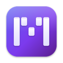
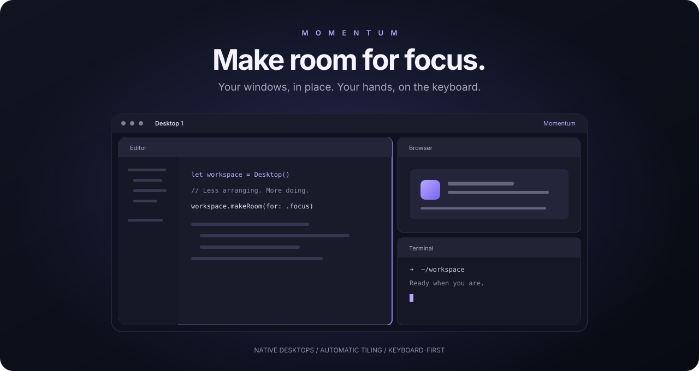

<p align="center">
  
</p>

<h1 align="center">Momentum</h1>

<p align="center">
  <strong>A little less window management. A lot more flow.</strong><br>
  A native, keyboard-first workspace for focus and productivity on macOS.
</p>

<p align="center">
  
  
  <a href="https://github.com/jvrviegas/momentum/releases"></a>
</p>

<p align="center">
  <a href="#get-started"><strong>Get started →</strong></a> &nbsp; · &nbsp;
  <a href="#road-to-v1">Road to v1</a> &nbsp; · &nbsp;
  <a href="#keyboard-first-by-design">Shortcuts</a> &nbsp; · &nbsp;
  <a href="CHANGELOG.md">What's new</a> &nbsp; · &nbsp;
  <a href="https://github.com/jvrviegas/momentum/issues">Feedback</a>
</p>

<p align="center">
  
  <sub>Workspace illustration · not an application screenshot</sub>
</p>

## Stay in your flow.

Your editor. Your browser. Your terminal. Right where you need them.

Momentum automatically arranges your windows, gives every native macOS Desktop its own layout, and lets you move through your workspace without reaching for the mouse. It lives quietly in the menu bar and works with Mission Control rather than replacing it.

<table>
  <tr>
    <td width="50%" valign="top">
      <h3>Room for everything.</h3>
      <p>Open a window and the layout makes space. BSP tiling divides your workspace into tiles, with gaps and padding you can tune.</p>
    </td>
    <td width="50%" valign="top">
      <h3>Keep your hands on the keys.</h3>
      <p>Focus, swap, float, and retile. Navigate in four directions with familiar Vim-style keys or record shortcuts of your own.</p>
    </td>
  </tr>
  <tr>
    <td valign="top">
      <h3>Native Desktops. Separate contexts.</h3>
      <p>Keep a layout for each Desktop. Send a window to another without moving your cursor or leaving the Desktop you're on.</p>
    </td>
    <td valign="top">
      <h3>Structure, with breathing room.</h3>
      <p>Float individual windows or exclude whole apps. Pause tiling from the menu bar whenever you want manual control.</p>
    </td>
  </tr>
  <tr>
    <td valign="top">
      <h3>Motion that follows your lead.</h3>
      <p>Display-synchronized transitions keep layout changes animated. Reduce Motion is respected, and animations can be turned off.</p>
    </td>
    <td valign="top">
      <h3>Your setup. Your way.</h3>
      <p>Adjust everything in Settings or edit a live-reloaded JSON file. No restart needed when your configuration changes.</p>
    </td>
  </tr>
</table>

## Road to v1

Arrange your windows, stay focused, and keep your work moving—all from one quiet menu-bar app. Window management is the foundation; focus tools should complement it, not become another distraction.

This checklist is the **single high-level feature tracker for v1**, not a list of features already shipping. No release date is promised.

- **Checked:** implemented in the source preview, not a guarantee of release readiness.
- **Unchecked, unlabelled:** planned and not yet implemented.
- **Partial:** some implementation or infrastructure exists, but the feature is incomplete.
- **Awaiting validation:** compatibility or release behavior still needs verification.

Update this checklist when implementation or validation changes a feature's status. Detailed implementation plans belong under `docs/plans/` as work on each feature starts; those plans track tasks and verification without duplicating this feature tracker.

### Organize your workspace

- [x] Automatic BSP window tiling with configurable gaps and padding.
- [x] Separate layouts for native macOS Desktops.
- [x] Keyboard navigation and window swapping.
- [x] Desktop switching through configured macOS Mission Control shortcuts.
- [x] Send windows to another Desktop using private macOS APIs; fully enabled SIP compatibility is **awaiting validation** (tracked below).
- [x] Floating windows, app exclusions, and a menu-bar toggle to pause tiling.
- [x] Configurable shortcuts through Settings and live-reloaded JSON.
- [x] Animated layout transitions with Reduce Motion support.
- [ ] Multi-display tiling beyond the main display.

### Keep work uninterrupted

- [ ] **Awaiting validation:** Keep Awake toggle accessible from the menu bar and a configurable shortcut.
- [ ] **Awaiting validation:** timed Keep Awake sessions or manual control until stopped.
- [ ] **Awaiting validation:** separate options to prevent system sleep and keep the display on.
- [ ] **Awaiting validation:** clear menu-bar indication when Keep Awake is active.

Keep Awake is implemented in this source preview, with automated and native assertion checks passing. Interactive sleep/lid/lock, idle/display and accessibility acceptance remain pending; see the [validation record](docs/qa/keep-awake-validation.md).

### Stay focused

- [ ] Lightweight focus timer with configurable duration and keyboard controls.
- [ ] Optional break reminders.
- [ ] Focus sessions that can optionally enable Keep Awake.
- [ ] Restore the previous Keep Awake state when a focus session ends or is cancelled.

### Stay out of your way

- [x] Menu-bar app with no Dock presence.
- [x] Basic Accessibility permission prompting and guidance in Settings.
- [ ] Launch at login.
- [ ] **Partial:** release-ready permission onboarding and recovery, including permission revocation; basic prompting and Settings guidance exist.
- [ ] **Partial:** Developer ID-signed, notarized installer; release tooling exists, but distribution remains source-only.
- [ ] **Partial / awaiting validation:** working automatic-update delivery for distributed releases; Sparkle and “Check for Updates” are integrated, but end-to-end delivery remains unverified.
- [ ] **Awaiting validation:** supported macOS and Desktop-move behavior with fully enabled SIP; previous move verification used partially disabled SIP. Do not require users to disable SIP.

**Not in v1:** clipboard history, app launching, notes, task management, or detailed productivity analytics.

The [landing page prototype](docs/landing/prototype.html) separates capabilities available in the preview from planned v1 features. Its workspace illustration and film are concepts, not application recordings.

## Get started

> [!IMPORTANT]
> Momentum is currently an **early-stage source preview**, not a finished distribution. Releases are source-only; a Developer ID-signed, notarized installer is not yet available. **Only the main display is tiled.**

### What you'll need

- **macOS 27.0 or later**, matching the project's current deployment target.
- **Xcode 27 or later** to build from source; the project uses Swift 6.
- **Accessibility permission** to move, resize, and focus other apps' windows.

> [!WARNING]
> Native Desktop integration uses unsupported private macOS APIs and may break after system updates. Direct moves were verified on **macOS 27.0.1 with SIP already partially disabled**. Fully enabled System Integrity Protection (SIP) has not been verified on that build. **This is not a recommendation to disable SIP.**

### Build your copy

```sh
git clone https://github.com/jvrviegas/momentum.git
cd momentum
open Momentum.xcodeproj
```

1. Let Xcode resolve the Sparkle Swift Package dependency.
2. Select the **Momentum** scheme and **My Mac** destination.
3. In **Signing & Capabilities**, replace the repository's development team with your own for both the app and test targets, if needed.
4. Build and run with **⌘R**. Momentum appears in the menu bar, not the Dock.
5. When prompted, enable Momentum under **System Settings → Privacy & Security → Accessibility**. Tiling starts once access is granted.

For a predictable setup:

- Turn off **“Drag windows to screen edges to tile”** under **System Settings → Desktop & Dock**, so macOS's built-in tiling does not compete with Momentum.
- Create any additional Desktops you want to use in Mission Control.
- To use Desktop-switching shortcuts, enable **“Switch to Desktop N”** under **System Settings → Keyboard → Keyboard Shortcuts → Mission Control**. Sending windows to Desktops does **not** require these system shortcuts.

Use **Tiling Enabled** in the menu bar to pause or resume automatic tiling.

## Keyboard-first by design

**⌥** = Option (Alt), **⇧** = Shift. Direction keys use Vim-style positions: **H** left, **J** down, **K** up, **L** right.

| Action | Shortcut |
| --- | --- |
| Focus a window left / down / up / right | <kbd>⌥</kbd> + <kbd>H</kbd> / <kbd>J</kbd> / <kbd>K</kbd> / <kbd>L</kbd> |
| Swap a window left / down / up / right | <kbd>⌥</kbd> + <kbd>⇧</kbd> + <kbd>H</kbd> / <kbd>J</kbd> / <kbd>K</kbd> / <kbd>L</kbd> |
| Switch to Desktop 1–9 | <kbd>⌥</kbd> + <kbd>1–9</kbd> |
| Send the focused window to Desktop 1–9 | <kbd>⌥</kbd> + <kbd>⇧</kbd> + <kbd>1–9</kbd> |
| Toggle the focused window's floating mode | <kbd>⌥</kbd> + <kbd>⇧</kbd> + <kbd>Space</kbd> |
| Retile | <kbd>⌥</kbd> + <kbd>⇧</kbd> + <kbd>R</kbd> |

Change bindings in **Settings**. Shortcut keys refer to physical US-layout key positions; the Settings UI displays the corresponding character for your current keyboard layout. Duplicate or unavailable bindings are flagged there.

Desktop numbers follow Mission Control order, excluding fullscreen Spaces. Destinations must already exist on the main display. If a move fails, the existing layout stays intact and an error appears in the menu and Settings.

## Keep Awake (awaiting manual acceptance)

Open Momentum's menu-bar popover, choose **Duration** and **Mode**, then **Start**. Defaults are **30 minutes, system-only**; selections save without starting. Active timed sessions offer **+15/+30/+60 min**, added to the existing deadline, and a rounded-up minutes indicator. **Until stopped** has no countdown. **Stop** or the toggle ends the session; relaunch always starts inactive.

System-only requests idle system-sleep protection while allowing display sleep. System-and-display requests both idle protections. Neither overrides explicit Sleep, lid close, locking or critical-battery safeguards. Keep Awake does not require Accessibility permission and works independently of tiling. Errors are inline with Retry; remaining OS/UI acceptance is documented above.

Optionally bind **Toggle Keep Awake** in Settings; no shortcut is assigned by default. Full branch behavior and evidence limitations are in the [draft functional spec](docs/spec/keep-awake.md).

## Make it yours

Start with **Settings** to adjust spacing, record shortcuts, choose floating apps, and control animations. Prefer a dotfile? The same configuration lives here:

```text
~/.config/momentum/tiling.json
```

The file is created automatically and reloaded when edited.

<details>
<summary><strong>Explore the JSON configuration</strong></summary>

```json
{
  "gap": 8,
  "outerPadding": 8,
  "animationsEnabled": true,
  "ignoreReduceMotion": false,
  "keepAwake": {
    "duration": "30m",
    "mode": "system"
  },
  "floatingBundleIDs": [
    "com.apple.systempreferences"
  ],
  "bindings": {
    "focus-left": "alt+h",
    "move-left": "alt+shift+h",
    "switch-to-desktop-1": "alt+1",
    "send-to-desktop-1": "alt+shift+1",
    "toggle-float": "alt+shift+space",
    "retile": "alt+shift+r",
    "toggle-keep-awake": null
  }
}
```

- `gap` and `outerPadding` accept **0–100 points**.
- `floatingBundleIDs` excludes apps from tiling by bundle identifier. System Settings is excluded by default.
- `animationsEnabled` toggles animated tiling. Reduce Motion is respected unless `ignoreReduceMotion` is enabled; that override affects Momentum only and does not change the system preference.
- Binding modifiers are `ctrl`, `alt`, `shift`, and `cmd`. Set a binding to `null` to unbind it; omitted actions keep their defaults.
- `keepAwake.duration` accepts `15m`, `30m`, `1h`, `2h`, `4h`, `8h`, or `until-stopped`; `keepAwake.mode` accepts `system` or `system-and-display`. Missing fields use first-use defaults; present nulls, wrong types or unknown values reject the reload. Runtime sessions/deadlines are never saved. Valid external edits affect future sessions, not an active mode/deadline.
- Invalid JSON or invalid configuration values leave the previous configuration active. Errors are shown in Settings.

</details>

## Under the hood

Built with **Swift 6, SwiftUI, and AppKit**, using Accessibility APIs for window control and a native Objective-C bridge for Desktop integration. [Sparkle](https://github.com/sparkle-project/Sparkle) provides the updater infrastructure; distribution tooling is included for future signed releases.

<details>
<summary><strong>Build and test from the terminal</strong></summary>

Build from the command line:

```sh
xcodebuild -project Momentum.xcodeproj \
  -scheme Momentum \
  -configuration Debug \
  -destination 'platform=macOS' \
  build
```

Run the test suite:

```sh
xcodebuild -project Momentum.xcodeproj \
  -scheme Momentum \
  -destination 'platform=macOS' \
  test
```

These commands use the project's signing settings; configure your development team in Xcode first if necessary. When hosting unit tests, the app uses a temporary config and does not start tiling, the updater, global hotkeys, native power assertions or lifecycle listeners. Explicit unit tests inject fake power/clock/scheduling clients; the existing Carbon collision test registers and removes one test shortcut.

</details>

<details>
<summary><strong>Explore the project structure</strong></summary>

| Path | Purpose |
| --- | --- |
| `Momentum/MyApp.swift`, `Momentum/MenuBarContent.swift` | App composition and native menu-bar popover |
| `Momentum/AppController.swift` | Application action/config routing and lifecycle |
| `Momentum/KeepAwakeService.swift`, `Momentum/PowerAssertions.swift` | Keep Awake sessions and native idle-sleep assertions |
| `Momentum/TilingManager.swift` | Window management and per-Desktop layouts |
| `Momentum/BSPTree.swift` | BSP layout tree |
| `Momentum/AXWindow.swift`, `Momentum/WindowObserver.swift` | Accessibility window control and observation |
| `Momentum/WindowAnimation.swift` | Tiling animation logic |
| `Momentum/Spaces.swift`, `Momentum/SpaceMover.swift`, `Momentum/NativeSpaceMove.m` | Native Desktop integration |
| `Momentum/Config.swift`, `Momentum/ConfigStore.swift` | Configuration defaults, persistence, and live reload |
| `MomentumTests/` | Automated tests |
| `scripts/release.sh` | Signed DMG, notarization, and Sparkle appcast tooling |

</details>

See [CONTRIBUTING.md](CONTRIBUTING.md) for commit and release conventions. Distribution prerequisites are documented in [scripts/release.sh](scripts/release.sh); development-signed builds should not be published as notarized installers.

## Need a hand?

<details>
<summary><strong>Tiling, shortcuts, and Desktop moves</strong></summary>

- **Windows are not tiling:** check Accessibility access, confirm **Tiling Enabled** is on, and make sure the windows are on the main display and not excluded or floating.
- **Desktop switching does nothing:** enable the matching Mission Control shortcuts in System Settings and confirm the destination Desktop exists.
- **Sending a window fails:** check the move error in the menu or Settings. Native move compatibility can vary with macOS and SIP configuration.
- **A shortcut does not work:** check Settings for a duplicate binding or a shortcut macOS refused to register.
- **Window motion feels inconsistent:** animation behavior varies by app. Disable animations in Settings if needed.

</details>

When [reporting an issue](https://github.com/jvrviegas/momentum/issues), include your macOS version, Momentum version, affected app, display/Desktop setup, and steps to reproduce. For Desktop-move failures, include the displayed error and SIP status.
